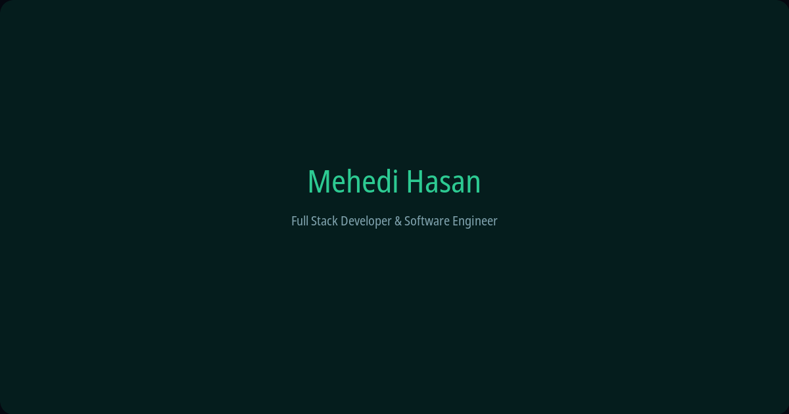
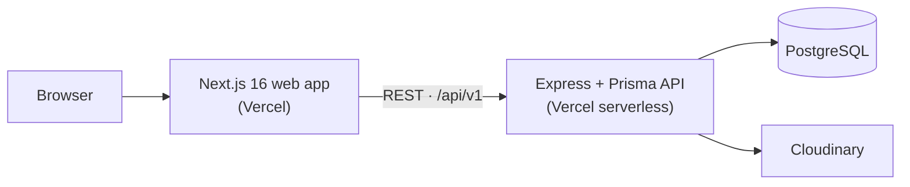

# Mehedi Hasan — Portfolio

[](https://nextjs.org)
[](https://react.dev)
[](https://www.typescriptlang.org)
[](https://tailwindcss.com)
[](https://expressjs.com)
[](https://www.prisma.io)
[](https://www.postgresql.org)

**A production-grade developer portfolio and content platform** — an animated Next.js 16 front end powered by a self-hosted Express + Prisma CMS.

[Live Site](https://mehedi-hasan-portfolio-client.vercel.app) · [API Status](https://mehedi-hasan-portfolio-server.vercel.app) · [LinkedIn](https://www.linkedin.com/in/mehedi-hasan-893500301) · [GitHub](https://github.com/Mehedihasan444)



## Overview

This repository contains my personal portfolio website along with the custom CMS that powers it. The public site is server-rendered, ISR-cached, and built around motion and WebGL — while every piece of its content (projects, blog posts, skills, experience, testimonials, site settings) is managed through a token-gated admin panel instead of hardcoded files.

It is deliberately built as a production system rather than a static page: two independently deployed Vercel applications, a typed PostgreSQL schema with migrations and seeding, a hardened Express middleware chain, and CI-grade quality gates (zero-warning ESLint, strict TypeScript, conventional commits). Heavy animations are progressively disabled for touch devices, reduced-motion users, and low-end hardware, and long-running animation loops pause when the tab is hidden.

## Features

### Public site

- **12 animated sections** — hero, about, skills, experience, projects, education, certifications, achievements, GitHub activity, testimonials, blog preview, and contact.
- **Project showcase** — filterable listing with rich detail pages, image galleries with lightbox, and markdown case studies.
- **Blog** — post listing and reading pages served from the CMS.
- **Live GitHub activity** — contribution heatmap and repository language breakdown.
- **Contact form** — validated client-side and persisted server-side with spam/DoS protection.
- **Motion & WebGL** — interactive 3D globe and glitter backgrounds (three.js / React Three Fiber), GSAP + Framer Motion choreography, and Lenis smooth scrolling — all of them reduced or disabled automatically on touch devices, `prefers-reduced-motion`, and background tabs.
- **SEO-ready** — metadata, Open Graph image, sitemap, and robots configuration.

### Admin CMS (`/admin`)

- Token-gated login (JWT in httpOnly cookies) with a dashboard.
- Full create / read / update / delete management for: projects, skills, experience, education, certifications, achievements, blog posts, testimonials, contact messages, and site settings / SEO metadata.
- Image uploads through Cloudinary.
- Public reads, authenticated writes — enforced by a shared CRUD factory and Zod validation on every resource.

### Engineering

- **Monorepo** — pnpm workspaces + Turborepo with cached `dev`, `build`, `lint`, and `typecheck` pipelines.
- **Performance-first** — Next.js `cacheComponents`, ISR (`revalidate: 60`) with `React.cache` request deduplication, idle-deferred heavy work, throttled input handlers, and capped particle counts.
- **Security** — Helmet, CORS allowlist, rate limiting, Zod request validation, bcrypt password hashing, and httpOnly cookie sessions.
- **Quality gates** — `eslint --max-warnings=0`, `tsc --noEmit`, Prettier (with the Tailwind class-order plugin), commitlint + Husky on every commit.

## Tech Stack

| Layer            | Technologies                                                                                          |
| ---------------- | ----------------------------------------------------------------------------------------------------- |
| **Frontend**     | Next.js 16 (App Router, `cacheComponents`), React 19, TypeScript 5.7, Tailwind CSS 4, shadcn-style UI |
| **Motion & 3D**  | three.js + React Three Fiber + drei, GSAP, Framer Motion, Lenis                                       |
| **Backend**      | Node.js, Express 4, Prisma 6, Zod, JWT (httpOnly cookies), bcrypt, Pino, Cloudinary                   |
| **Data**         | PostgreSQL 16 (Docker for local development)                                                          |
| **Tooling & CI** | pnpm 9.15 workspaces, Turborepo, ESLint 9, Prettier, commitlint, Husky, Vercel                        |

## Architecture



```
apps/
  web/        Next.js site — public pages in src/app/(main), admin panel in src/app/admin
  api/        Express API — src/modules (auth, contact, upload, CRUD), prisma/ schema + seed
docs/         Design, product, and audit documentation
AGENTS.md     Architecture, performance, and contribution rules — read before editing
```

## Getting Started

**Prerequisites:** Node.js ≥ 20.19, [pnpm 9.15](https://pnpm.io) (via `corepack enable`), Docker (for local PostgreSQL).

```bash
# 1. Install workspace dependencies
pnpm install

# 2. Configure environment files
cp apps/web/.env.example apps/web/.env.local   # NEXT_PUBLIC_API_URL, NEXT_PUBLIC_SITE_URL
cp apps/api/.env.example apps/api/.env         # DATABASE_URL, JWT_SECRET, CORS_ORIGIN, Cloudinary…

# 3. Start PostgreSQL and prepare the database
pnpm --filter api docker:up                    # Postgres 16 + pgAdmin
pnpm --filter api prisma:migrate               # apply migrations
pnpm --filter api prisma:seed                  # admin user + demo content

# 4. Run both applications in parallel
pnpm dev                                       # web → :3000 · api → :4000
```

The site is then available at [http://localhost:3000](http://localhost:3000) and the API at `http://localhost:4000/api/v1` (status at the root route, health probe at `/api/v1/health`).

## Environment Variables

### `apps/web` — `.env.local`

| Variable               | Description                                                   |
| ---------------------- | ------------------------------------------------------------- |
| `NEXT_PUBLIC_API_URL`  | Base URL of the API (default `http://localhost:4000/api/v1`). |
| `NEXT_PUBLIC_SITE_URL` | Canonical origin used for metadata, sitemap, and robots.      |

### `apps/api` — `.env`

| Variable                                                               | Description                                                        |
| ---------------------------------------------------------------------- | ------------------------------------------------------------------ |
| `NODE_ENV`, `PORT`, `LOG_LEVEL`                                        | Runtime environment, port (default `4000`), and Pino log level.    |
| `DATABASE_URL`                                                         | PostgreSQL connection string.                                      |
| `JWT_SECRET`, `JWT_EXPIRES_IN`                                         | Session signing secret and token lifetime.                         |
| `CORS_ORIGIN`                                                          | Comma-separated allowlist; must include the web origin.            |
| `CLOUDINARY_CLOUD_NAME`, `CLOUDINARY_API_KEY`, `CLOUDINARY_API_SECRET` | Media upload credentials.                                          |
| `UPLOAD_DIR`                                                           | Local upload fallback directory.                                   |
| `ALLOW_PUBLIC_REGISTER`                                                | Public `/auth/register` stays blocked in production unless `true`. |
| `ADMIN_EMAIL`, `ADMIN_PASSWORD`                                        | Seed-only admin credentials.                                       |
| `POSTGRES_PASSWORD`, `PGADMIN_EMAIL`, `PGADMIN_PASSWORD`               | Docker-only database and pgAdmin credentials.                      |

## Commands

Run from the repository root:

| Command                             | Description                           |
| ----------------------------------- | ------------------------------------- |
| `pnpm dev`                          | Turbo dev — web + api in parallel     |
| `pnpm build`                        | Turbo build (web `.next`, api `dist`) |
| `pnpm lint`                         | ESLint with `--max-warnings=0`        |
| `pnpm typecheck`                    | `tsc --noEmit` across workspaces      |
| `pnpm format` / `pnpm format:check` | Prettier write / check                |
| `pnpm --filter api prisma:generate` | Regenerate the Prisma client          |
| `pnpm --filter api prisma:studio`   | Open Prisma Studio                    |
| `pnpm --filter api docker:down`     | Stop local PostgreSQL + pgAdmin       |
| `pnpm --filter web analyze`         | Production build with bundle analyzer |

## Deployment

Both applications deploy to Vercel as two separate projects (the CLI is linked per app: `apps/web/.vercel`, `apps/api/.vercel`).

```bash
pnpm --filter web build && (cd apps/web && vercel --prod)
pnpm --filter api build && (cd apps/api && vercel --prod)
```

API deployment notes:

- `apps/api/vercel.json` uses the legacy `builds` configuration, so Vercel skips the project build settings — always build `apps/api` locally before deploying so `dist/` is fresh.
- The `postinstall: prisma generate` script is required; without it the serverless function crashes at import time and the browser reports a misleading CORS error.
- Set `CORS_ORIGIN` on Vercel to include the web origin (e.g. `https://<web-domain>,http://localhost:3000`) and redeploy after changing any environment variable.

## Documentation

- [`AGENTS.md`](AGENTS.md) — architecture, performance guardrails, and contribution rules.
- [`docs/PRODUCT.md`](docs/PRODUCT.md) — product vision, sections, data model, and SEO.
- [`docs/DESIGN.md`](docs/DESIGN.md) — color, typography, and the glass/gradient system.
- [`apps/web/docs/PERFORMANCE_AUDIT_2026-08.md`](apps/web/docs/PERFORMANCE_AUDIT_2026-08.md) — production performance audit.
- [`docs/COMPLETE_PRODUCTION_AUDIT_2026-08.md`](docs/COMPLETE_PRODUCTION_AUDIT_2026-08.md) — full-stack production audit.

## Author

**Mehedi Hasan** — Full Stack Developer & Software Engineer, Dhaka, Bangladesh.

- GitHub: [@Mehedihasan444](https://github.com/Mehedihasan444)
- LinkedIn: [mehedi-hasan-893500301](https://www.linkedin.com/in/mehedi-hasan-893500301)
- X: [@MEHEDIH60833052](https://x.com/MEHEDIH60833052)
- Email: [mehedihasan67705251@gmail.com](mailto:mehedihasan67705251@gmail.com)

## License

This repository is public for portfolio review and reference. All rights are reserved — no license is granted for reuse, redistribution, or commercial use of the code or content. Please contact me for permission.
